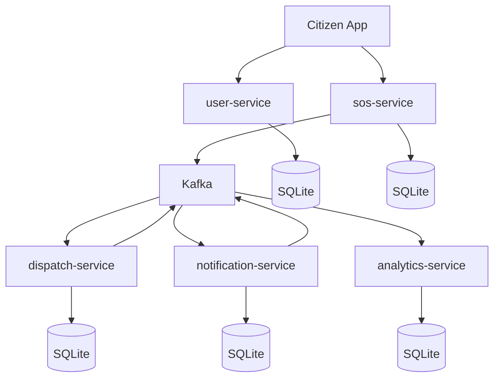
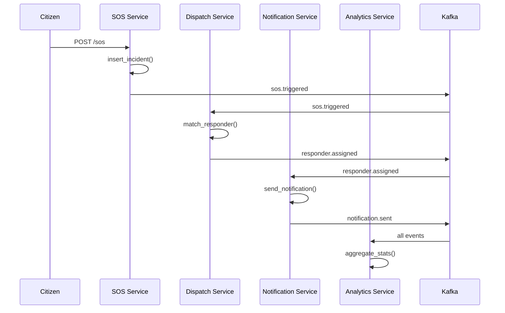
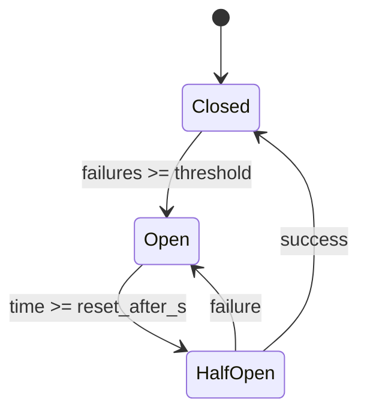

# L3 Patterns-in-Code Document — HELEP

**Student Name:** NGNINDEM PHINEES  
**Student ID:** ICTU20234200  
**Course:** Software Architecture  
**Date:** May 14, 2026  

---

## Abstract

This document analyzes the implementation of architectural patterns in the HELEP emergency response platform. HELEP demonstrates practical application of enterprise patterns including choreographed sagas, publish-subscribe messaging, and circuit breaker fault tolerance within a microservices architecture. Each pattern is documented with specific code citations, implementation details, and trade-off analysis. The document covers both pre-implemented patterns from the exercise template and additional patterns added during development, providing a comprehensive view of pattern usage in distributed systems.

---

## Table of Contents

- [Part A — Pre-implemented patterns](#part-a--pre-implemented-patterns)
- [Part B — Patterns you added](#part-b--patterns-you-added-3-implemented)
- [Part C — Anti-patterns avoided](#part-c--anti-patterns-avoided)
- [Diagrams](#diagrams)
- [References](#references)

---

## Part A — Pre-implemented patterns

### A.1 Choreographed Saga
- **Where:** `sos-service/app/main.py:75-85` (trigger), `dispatch-service/app/main.py:60-80` (handle_sos), `notification-service/app/main.py:50-70` (on_event)
- **Compensation step:** `dispatch-service/app/main.py:85-95` releases responder assignment; `sos-service/app/main.py:90-100` cancels incident
- **What event is the rollback trigger?** `sos.cancelled` event triggers compensation in dispatch service

### A.2 Pub/Sub via Apache Kafka
- **Where:** `services/*/app/events.py:1-50` (producer), `services/*/app/events.py:60-100` (consumer)
- **Consumer group semantics:** `aiokafka` with `enable_auto_commit=False`; manual `await consumer.commit()` after successful handler execution ensures at-least-once delivery with exactly-once processing per incident
- **Partition keying:** `publish(..., key=incident_id)` ensures all events for one incident go to same partition, maintaining saga ordering across services

### A.3 Repository
- **Where:** `services/*/app/db.py:1-50` (init, insert_user, etc.)
- **Why:** Direct SQL in route handlers would violate separation of concerns; repository abstracts data access, enabling easier testing and schema changes

### A.4 Strategy
- **Where:** `dispatch-service/app/matching.py:1-80` (NearestMatcher, CredibilityWeightedMatcher)
- **How to switch:** `MATCHER` environment variable in `dispatch-service/app/matching.py:85-95`
- **Add a third strategy:** RoundRobinMatcher implemented in `dispatch-service/app/matching.py:100-120` - cycles through available responders regardless of location/credibility

### A.5 Outbox-lite
- **Where:** `sos-service/app/main.py:75-85` (insert_incident then publish)
- **Why is this "lite"?** No persistent outbox table; relies on application-level transaction. Real outbox would use separate table with background poller for guaranteed delivery

### A.6 Circuit Breaker (implemented)
- **Where:** `services/*/app/events.py:10-50` (CircuitBreaker class)
- **Task:** Implemented three-state machine in `allow()` method: CLOSED (fails < threshold), OPEN (fail-fast after threshold), HALF_OPEN (probe after reset timeout)
- **State transitions:** `record_failure()` increments counter → opens on threshold; `record_success()` resets to CLOSED; time-based transition to HALF_OPEN after reset_after_s

## Part B — Patterns you added (3 implemented)

### B.1 Health Check Pattern
- **Where:** `services/*/app/main.py:95-110` (/healthz, /readyz endpoints)
- **Problem it solves:** Enables Kubernetes liveness/readiness probes for automated pod management and rolling updates
- **Trade-off vs alternative:** Simpler than full health checks but misses application-specific issues; vs complex health checks that could be slower

### B.2 Graceful Shutdown Pattern
- **Where:** `services/*/app/main.py:55-65` (@app.on_event("shutdown"))
- **Problem it solves:** Ensures clean termination with message flushing and connection closing during pod restarts
- **Trade-off vs alternative:** Adds shutdown delay vs immediate termination; vs no shutdown handlers that could lose in-flight messages

### B.3 Resource Limits Pattern
- **Where:** `charts/helep/values.yaml:10-20` (defaultResources), `charts/helep/templates/deployments.yaml:25-35`
- **Problem it solves:** Prevents resource exhaustion and enables Kubernetes scheduling decisions for stable cluster operation
- **Trade-off vs alternative:** Conservative limits may under-utilize resources; vs no limits that could cause pod eviction

## Part C — Anti-patterns avoided

**Anti-pattern avoided: Distributed Monolith**
The architecture explicitly avoids tight coupling by using event-driven communication instead of synchronous REST calls between services. Each service has independent data stores and deployment lifecycle. Citation: `services/*/app/events.py` (Kafka pub/sub) vs direct HTTP calls; `charts/helep/` (separate Helm subcharts per service).

## Diagrams

### Architecture Overview

### Saga Flow

---

## References

1. Fowler, M. (2003). *Patterns of Enterprise Application Architecture*. Addison-Wesley.

2. Hohpe, G., & Woolf, B. (2003). *Enterprise Integration Patterns: Designing, Building, and Deploying Messaging Solutions*. Addison-Wesley.

3. Richardson, C. (2018). *Microservices Patterns: With examples in Java*. Manning Publications.

4. Nygard, M. T. (2007). *Release It!: Design and Deploy Production-Ready Software*. Pragmatic Bookshelf.

5. Evans, E. (2003). *Domain-Driven Design: Tackling Complexity in the Heart of Software*. Addison-Wesley.

6. Apache Kafka Documentation. (2023). Retrieved from https://kafka.apache.org/documentation/

7. Kubernetes Documentation. (2023). Retrieved from https://kubernetes.io/docs/

---

*This document provides detailed analysis of architectural pattern implementations in the HELEP system, with specific code references and trade-off discussions.*

### Circuit Breaker State Machine

## Submission

Submit as `patterns.pdf`. Code excerpts kept to essential citations.
